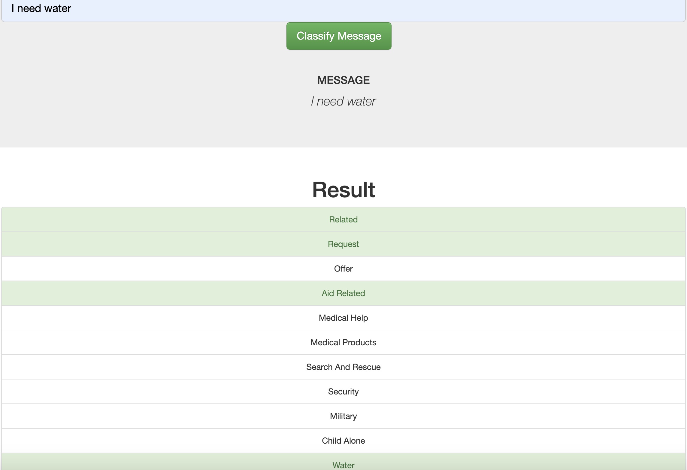
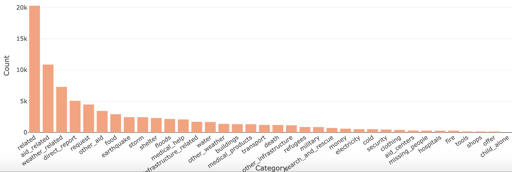

# Disaster Response Pipeline Project
### Description:
This project is aimed to build a disaster response classifier by using data from [Figure Eight](https://appen.com/). Accordingly, the ETL pipeline and NLP machine learning pipeline have been build to generate the model. Finally, the classifier model is put on the web app as shown below:

### Project Structure
- `app/`
  - `run.py`  - Web app file.
  - `template/`
    - `master.html`  -  Main page to look into dataset.
    - `go.html`  -  Disaster response classifier page.

- `data/`
  - `DisasterResponse.db`   - Database with the wrangled data.
  - `disaster_categories.csv`  - Disaster categories dataset.
  - `disaster_messages.csv`  - Disaster Messages dataset.
  - `process_data.py` - ETL pipeline script.
  

- `media/` 
  - `demo.png` - Disaster response classifier demo.
  - `imbalance.png` - Chart to show imbalanced dataset.

- `models/`
  - `train_classifier.py` - NLP machine learning pipeline script.

### Instructions:
1. Run the following commands to build up the database and the classifier model.

    - Run ETL pipeline to clean data and store in SQL database
        `python data/process_data.py data/disaster_messages.csv data/disaster_categories.csv data/DisasterResponse.db`
    - Run NLP machine learning pipeline to train classifier and save in pickle format
        `python models/train_classifier.py data/DisasterResponse.db models/classifier.pkl`

2. Run the following command in the app's directory to run your web app.
    `python run.py`

3. Go to http://0.0.0.0:3001/

### Issue:
As you can see the bar chart below, dataset has the imbalance problem. It tends to train a biased model. For example, there is no data relative to the category, *child_alone*. So, the classifier may not recognize the situation when a child encounters any problems.

